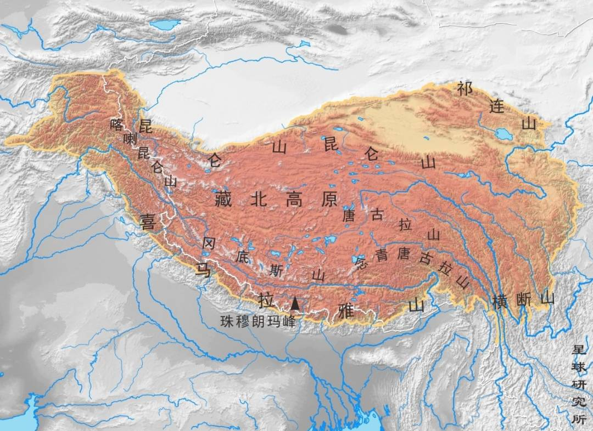
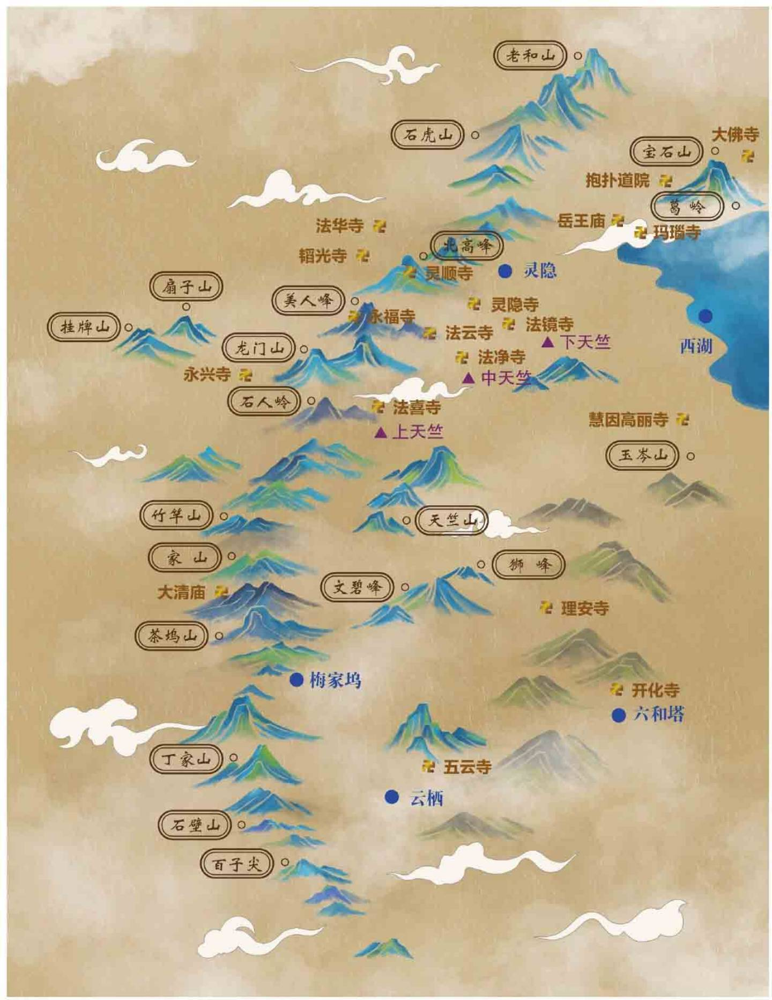

# 山

## 高度

一、贡嘎山，高程数据：7508.9 米；

二、四姑娘山，高程数据：6247.8米；

三、螺髻山，高程数据：4354.2米；

四、光雾山，高程数据：2507.2米；

五、狮子王，高程数据：4981.3米；

六、格聂山，高程数据：6174.5米；

七、央迈勇，高程数据：6033.0 米；

八、仙乃日，高程数据：5998.5 米；

九、夏诺多吉，高程数据：5951.3米。

[🔗](https://mp.weixin.qq.com/s/O2g1FPG9RbZJ4ytj0aTovA)

## 地区

### 杭州

