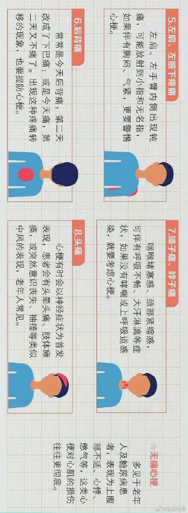

# 常见防护

[[toc]]

## 中暑

① 中暑根据症状的轻重可分为先兆中暑、轻症中暑、重症中暑。

② 先兆中暑时体温正常或略微升高，主要表现为大汗淋漓、四肢无力、口渴、头晕、头痛等症状。先兆中暑的急救需注意以下要点：赶快离开高温环境，寻找阴凉通风处休息。少量多次补充含有盐分的清凉饮料。在额头、太阳穴处涂抹或服用祛暑药物。

③ 重症中暑分为热痉挛、热衰竭和热射病。其中热射病最为严重，致死率高，主要表现为体温明显增高，开始时大量出汗，之后皮肤干热、无汗并伴有昏迷。发病后3小时为抢救的“黄金3小时”，需立即送往医院救治。[🔗](https://weibo.com/2803301701/OiOSte7vm)

## 心梗

[🔗](https://weibo.com/1774057271/NwmP4wxwj)

常见心脑血管疾病，如何紧急处理？

2016-03-09 教职工健康管理

数据显示，每天都有9000多人死于心脑血管病，也就是说每9秒就有1个人因为心脑血管病丧生！知道凶险的心脑血管疾病的一些发作信号，关键时候也许就能救上一命。

心梗

1.发作信号：

大汗、持续胸痛、后背痛

2.急性心梗发作症状：

·男性患者：持续胸痛（67%）和大汗（70%）；

·女性患者：放射痛、后背痛、恶心呕吐多，胸痛和大汗则相对少见；

·上了岁数的人：症状不太明显，大汗则对老年人最具有价值。也就是说，老年人发作时即便不怎么胸疼，但是出大汗就要注意了。

3.紧急处理——阿司匹林

① 嚼服300毫克阿司匹林

缓解心梗症状最主要的药物就是阿司匹林，如果有的话就迅速地嚼服300毫克。而硝酸甘油并不是对所有的心肌梗死都有效。

② 去最近的医院溶栓！

如果发病3小时内到医院的话，溶栓和介入治疗，在救命上没有差异，只要血管及时被疏通了都可以。而溶栓即便是县医院都是可以做的，而且非常便宜。

此时对于病人来说，每一个心肌细胞都至关重要，如果心肌死了，去再好的医院就都没有意义了。因此，放弃县医院而到大医院寻求救治是不明智的，时间越晚，效果都会越差。
脑梗

至少2/3的患者，本来可以通过急诊手术，顺利解决脑梗塞症状。但在临床中，99%以上的脑梗塞患者却错过了有效救治的黄金时间，最终得以成功手术的连1%都不到！

1.发作信号——左右劲儿不一样大、说话不清楚

① 突然感到一侧面部或肢体麻木或无力：嘴歪、流口水，肢体软弱无力，如拿筷子没劲夹不到菜，走路时一条腿拖步等；

② 突然出现言语含糊或语言障碍：与人交谈时突然出现说话困难或听不懂别人的话；

③ 突然出现头晕：周围景物出现旋转，站立不稳甚至晕倒在地；

④ 突然出现一侧眼睛看不见东西，数分钟或数秒钟即恢复，这是脑血管疾病的早期报警信号；

⑤ 突然出现呛咳、吞咽困难、疲倦、嗜睡、耳鸣、行走不稳等，也可能是脑血管病的先兆表现。

2.紧急处理——让患者歪头平躺

脑梗、脑出血并没有黄金急救时间，一般是越快越好。

① 一定要马上打120，在急救医生的帮助下救送患者，而不是家属在缺乏经验的情况下自行处理。可以让病人就地平躺，将头侧向一边。

② 到医院后立刻做脑CT，当CT检查没有脑出血，脑组织“尚未见异常”，这时要迅速做脑血管造影……这些程序环环相扣，非常紧密。在这个过程中，有些家属害怕患者由于检查挪动时再出意外、手术中出意外等情况，不能做出决定，迟迟不签字，无形中拖延了时间。

③ 一定要看急诊，别挂门诊。在急诊，梗塞患者通过绿色通道做CT，迅速查明情况，可以快速手术溶栓。

④ 所去的医院，应是具有动脉溶栓医疗条件的急诊医疗机构，还要24小时有出诊医生做动脉溶栓治疗，以保证患者在充裕的时间内得到救治。

脑出血

脑出血常在活动或情绪激动时发病，在发生脑出血的患者中，50%有先兆症状。

1.发作信号——剧烈的头痛

① 一般有头痛和呕吐，并迅速出现昏迷、偏瘫、大小便失禁等症状；

② 剧烈的头痛是脑出血的最常见症状。一旦出现剧烈的头痛，患者要首先想到脑出血的可能，应立即采取自救措施。

2.紧急处理——别乱动、冷敷头部

脑出血的最初5分钟，对于生命至关重要，被称为“黄金5分钟”。准确快速的家庭急救可以阻止疾病的发展，降低病死率、致残率。

① 一般情况下，脑出血从发作到昏迷有一段时间，要利用这段时间迅速拨打120，然后让自己到较平坦的地方，解开衣领，就地侧身平躺，尽量减少肢体活动，减少血压波动，保持心情平稳，等待救援。

② 如果家属在身边，赶紧打120，千万不要盲目搬动患者。可以给患者松解衣领，如果患者戴有活动性假牙，要及时取下。将患者侧卧，头部偏向一方，保证呼吸道畅通，以防呕吐物吸入气管，引起窒息。

③ 要尽量避免剧烈晃动患者头部，天热时可将头部放置冷毛巾、冰水、冰袋，可用雪糕、冰棒替代，使头部血管收缩，减少脑部出血，减少后遗症的发生，保持通风。

④ 等待急救车时，家属可拿出血压计给病人量血压。如果脑出血患者的血压不超过180mmHg，那么家人就耐心等急救车；如果超过180mmHg，那么家属要考虑给病人吃降压药。
冠心病

1.发作信号——心绞痛

① 心绞痛，心前区出现的一种不可名状的、让人难受的压榨感和憋闷感。

② 有时候也会表现为心悸、喉部紧缩感以及肩背部疼痛等症状。

2.紧急处理——速效救心丸、硝酸甘油

① 如果发现自己出现心绞痛等症状不能缓解时，含服硝酸甘油或速效救心丸；

② 自己或求助于旁人拨打120，切忌跑步或快走赶到医院。因为越着急，越运动，心率加快，心脏负荷就越重，心肌缺血就会越严重。