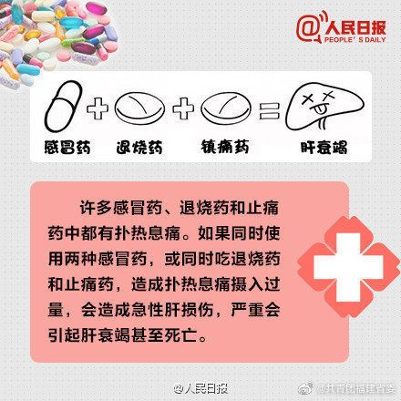
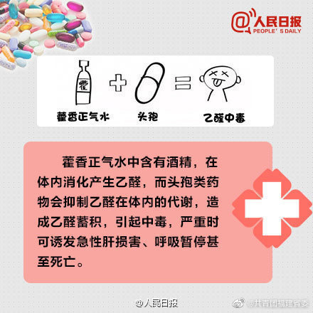
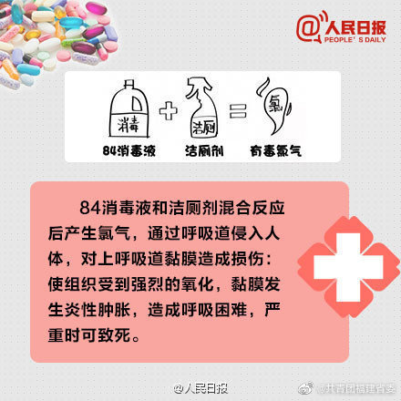
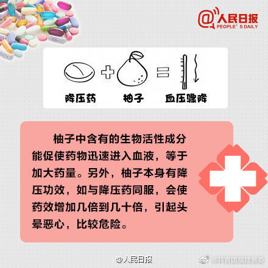
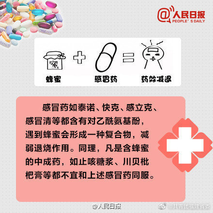
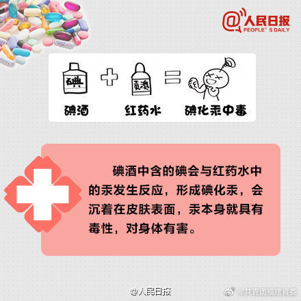
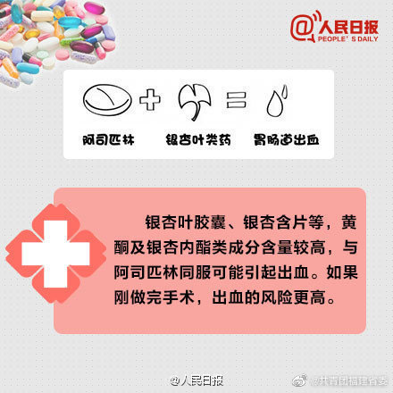
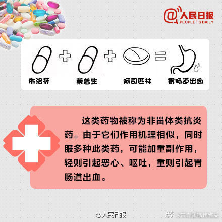
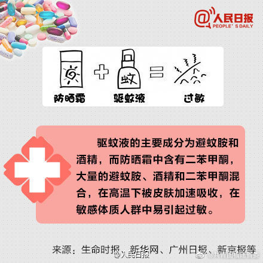

# 用药注意事项

[[toc]]

## 感冒药 + 退烧药 + 镇痛药 = 肝衰竭

## 藿香正气水 + 头孢 = 乙醛中毒

## 84消毒液 + 洁厕剂 = 有毒氯气

## 降压药 + 柚子 = 血压骤降

## 蜂蜜 + 感冒药 = 药效减退

## 碘酒 + 红药水 = 碘化汞中毒

## 阿司匹林 + 银杏叶类药 = 胃肠道出血

## 布洛芬 + 萘普生 + 阿司匹林 = 胃肠道出血

## 防晒霜 + 驱蚊液 = 过敏

