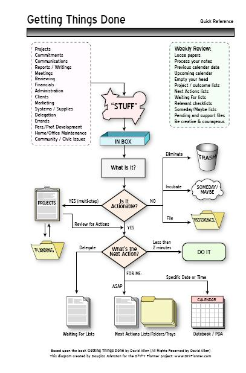

# GTD

GTD 是“Getting Things Done”（完成每一件事）的缩写。

## 什么是GTD？

GTD 的基本理论是把一个人所要要完成的任务和事件全部从大脑中移出来，记录到纸上。这样，大脑便会不被多余的事情打搅而集中于现在所需完成的事情上面。

GTD 的创始人：David Allen，提倡建立一个详细的To-Do列表，比如说：列出要打的电话，去市区要完成的任务。他还提出一个 **“二分钟法则”**：如果任何一件可以在二分钟内完成的事情，那么就必须得现在马上完成。

## GTD守则

**收集任务**  
（把所有你需要做的和需要完成的事情全部记录下来，放在一个“收集箱”里）  
↓  
**过程**  
（每次按照顺序，一次只做一件事）  
↓  
**管理任务**  
（列出有详细内容的to-do列表）  
↓  
**复习任务**  
（复习你所有完成的任务，计划方案和等待完成的事情。确保每一件新进入的任务都有很好的安排）  
↓  
**开始行动！**

## GTD处理图表

[《尽管去做——无压工作的艺术》是原书《Getting Things Done》的中文版](./gtd_cn.pdf)

## GTD时间管理核心原理：五步法优化任务管理

GTD时间管理方法论由戴维・艾伦提出，核心在于通过收集、处理、组织、回顾、执行这五大核心步骤，将混沌无序的任务清单转化为可落地、易执行的行动指南。

1. 全渠道收集：通过APP、邮箱、笔记、语音、浏览器插件等入口事无巨细地记录所有任务，避免遗忘重要事项。
    
2. 标准化处理：判断任务可行性，包括是否执行、核实执行、有谁执行，比较类似现在常说的SOP，保留有效信息，剔除无效信息。
    
3. 结构化组织：按任务场景、任务时间、任务优先级等维度，形成可视化任务地图，指导任务完成和时间管理。
    
4. 周期性回顾：每天、每周或每月复盘任务完成情况，确保任务清单与实际进度同步。
    
5. 场景化执行：在合适的场景专注完成对应的任务，减少多任务切换造成的时间和精力浪费，提升单位时间产出。
    

总而言之，这套方法论的底层逻辑是释放行动者的大脑记忆压力，从而将注意力聚焦于更高价值和优先级更高的任务，因此十分适合知识工作者、团队管理者和多线任务处理者优化原有的时间管理体系。

参考：

[什么是GTD](https://www.mifengtd.cn/articles/%e4%bb%80%e4%b9%88%e6%98%afgtd.html)

[GTD时间管理7款主流工具多场景选型指南-开发者社区-阿里云](https://developer.aliyun.com/article/1667639)